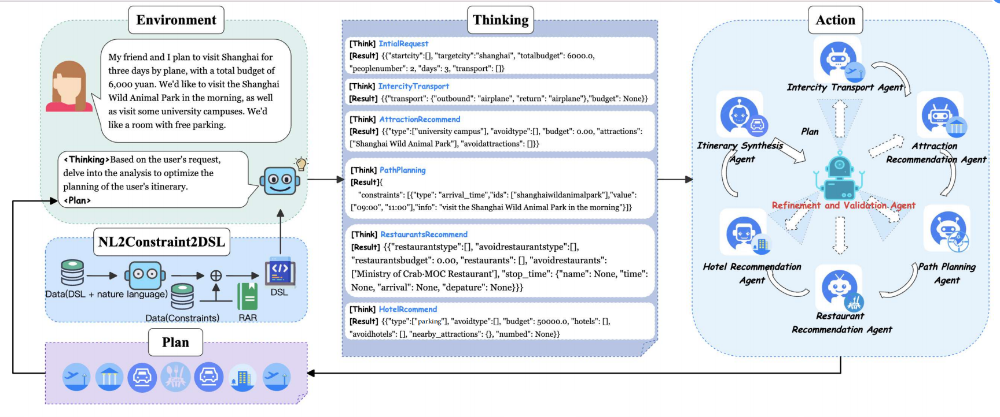

<h1 align="center"> A Constraint-Aware Multi-Agent Optimization Framework with Robust Domain Specific Language Generation for Travel Planning </h1>

This is the official codebase for the paper "**A Constraint-Aware Multi-Agent Optimization Framework with Robust Domain Specific Language Generation for Travel Planning**".

## 🗺️ Overview



The Overview of **CAMTP** Framework.

## 🚀 Getting Started

### Install dependencies

```
cd chinatravel/agent/tpc_agent
pip install -r requirements.txt
```

### Install models

We uploaded Qwen3-8B to Hugging Face under the path BW297/qwen3-8B. After downloading it from Hugging Face, **place it in the tpc_agent directory and name the folder qwen3-8B**, and it will run correctly.

```
export HF_ENDPOINT=https://hf-mirror.com 
pip install -U "huggingface_hub[cli]"
huggingface-cli download BW297/qwen3-8B --local-dir qwen3-8B
```

### Run CAMTP

```
python run_tpc.py --splits tpc_aic_phase1 --agent TPCAgent --llm TPCLLM
```

## 📦 Repository Integration Guide
**To use this repository within the ChinaTravel main project, place the entire repository into the following directory:**

```
ChinaTravel/chinatravel/agent/
```

The upstream project can be found here:

👉 https://github.com/LAMDASZ-ML/ChinaTravel

Once placed in this directory, all modules in this repository can be directly imported and executed within the ChinaTravel project without additional configuration.

If you need access to the two-stage datasets used in the competition, they are available at the following link: \url{https://chinatravel-competition.github.io/IJCAI2025/}


